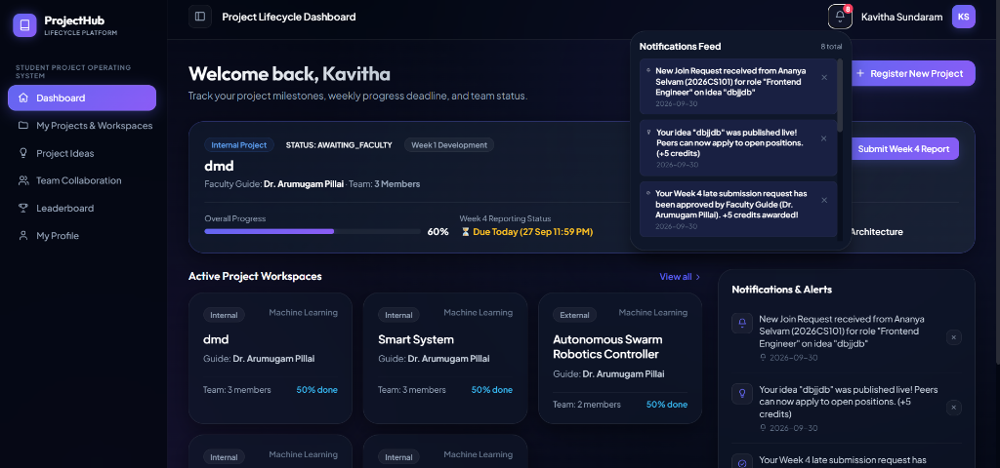
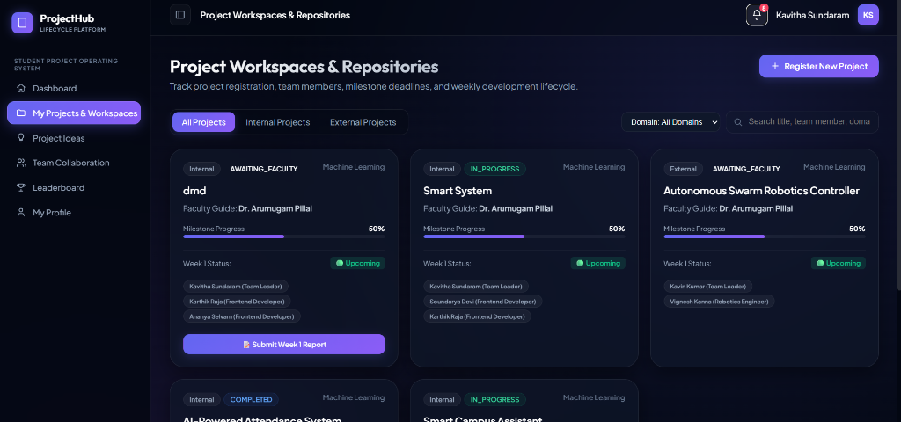
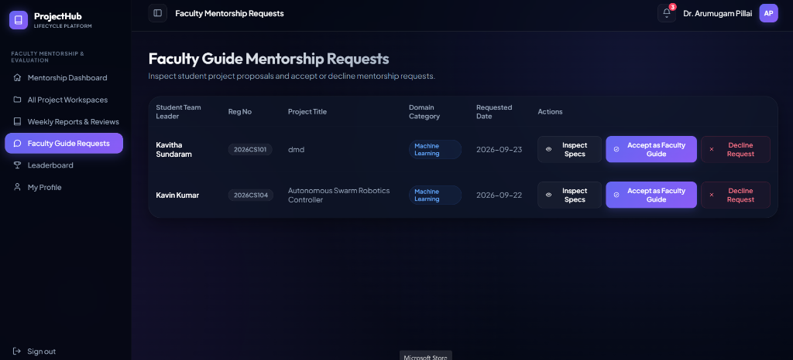
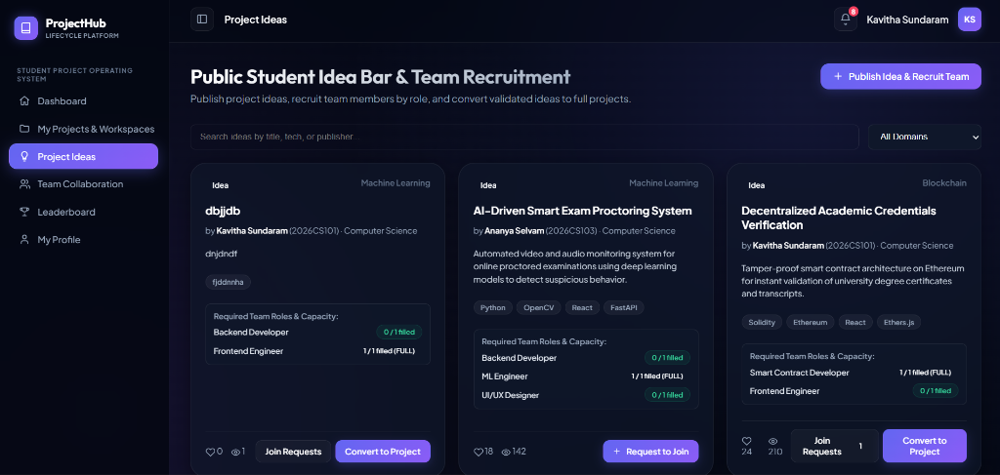
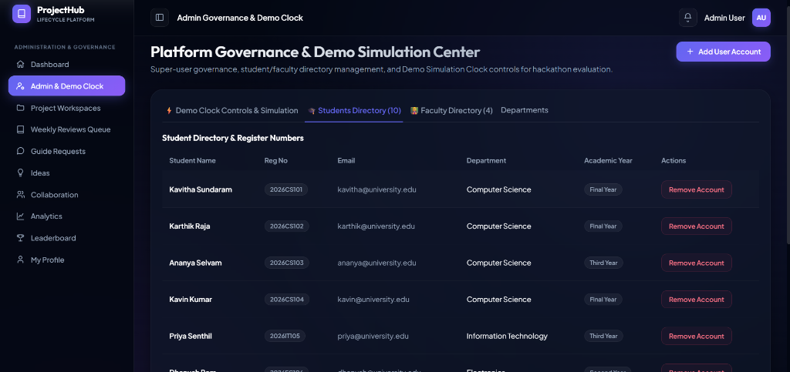

<div align="center">

# 🎓 ProjectHub — Student Project Development & Lifecycle Management Platform

**Plan your project. Track your progress. Build together. Complete with confidence.**

ProjectHub is a comprehensive academic project lifecycle management platform designed for student teams, faculty mentors, and institutional administrators. It manages the complete development journey of student projects — from initial registration and team formation through milestone planning, weekly progress tracking, mandatory faculty review comments, late submission governance, credit awards, and final completion.

[](https://react.dev/)
[](https://nodejs.org/)
[](https://www.postgresql.org/)
[](https://expressjs.com/)
[](LICENSE)

---

### 🌐 Live Platform Deployment & Links
- **🚀 Live Deployed Web App**: [https://student-project-tracker-zeta.vercel.app/](https://student-project-tracker-zeta.vercel.app/)
- **📦 GitHub Repository**: [https://github.com/gitabi14/Student-Project-Tracker.git](https://github.com/gitabi14/Student-Project-Tracker.git)

</div>

---

## 📸 Application Showcase & Screenshots

### 1. Student Lifecycle Dashboard & Real-Time Notifications


### 2. Project Workspaces, Repositories & Milestone Tracking


### 3. Faculty Mentorship Requests & Inspection Workspace


### 4. Public Student Idea Bar & Role-Based Team Recruitment


### 5. Institutional Admin Governance & Student Directory Management


---

## 🚀 Complete Student Project Development Lifecycle

```
 PROJECT REGISTRATION  --->  TEAM FORMATION  --->  FACULTY GUIDE SELECTION
          |                                                   |
          v                                                   v
   COMPLETION (+50 pts)  <---  FACULTY REVIEW  <---  MILESTONE & WEEKLY PROGRESS
```

### 1. Project Registration & Team Formation
- **Multi-Step Wizard**: Register Internal or External academic projects specifying Title, Domain Category, Tech Stack, and Specification Abstract.
- **Team Formation**: Search student database by Register Number (e.g. `2026CS101`) or Name and assign specific project roles (`Team Leader`, `Frontend Developer`, `Backend Developer`, `ML Engineer`, `UI/UX Designer`, `Testing Engineer`, etc.).

### 2. Student-Selected Faculty Mentorship & Workload Governance
- **Faculty Guide Selection**: Students manually search and select available Faculty Guides based on specialization and workload capacity (`currentProjectsCount / maxPendingThreshold`).
- **Mentorship Request Lifecycle**: Pending requests are listed exclusively in the Faculty Guide Requests tab. Accepting a request sets status to `IN_PROGRESS` and `FACULTY_CONFIRMED` (+0 credits). Declining removes the request from the pending list and allows students to re-select.

### 3. Milestone Planning & Weekly Progress Tracking
- **Milestone Engine**: Define title, description, deadline, assigned team member, deliverable links, and progress sliders (0-100%). Statuses update dynamically: `NOT_STARTED`, `IN_PROGRESS`, `COMPLETED`, `OVERDUE`.
- **Weekly Progress Workspace**: Week-by-week development logs capturing planned work, completed work, current tasks, blockers, next week's plan, member contributions, and evidence commit links.

### 4. Mandatory Faculty Review Comments & Audit Log History
- **Mandatory Review Comment Rule**: Faculty MUST provide a non-empty review comment before approving, requesting changes, or responding to late submission requests. Missing comments trigger HTTP `400 Bad Request` backend validation.
- **Review History & Audit Log**: Every review event is permanently recorded in `report.reviewHistory` with timestamp, author, author role, decision badge, comment, and credit points. Resubmissions preserve history and log a `STUDENT_RESUBMITTED` event.

### 5. Overdue Late Submission Governance & Demo Mode Clock
- **Overdue Detection**: Submitting past due date requires a mandatory `lateReason`, putting the report into `LATE_REQUEST_PENDING` and notifying the Faculty Guide in RED.
- **Simulated Demo Clock**: Control system date dynamically (`/api/demo/set-date`) to simulate week progression, deadlines, and overdue states in Demo Mode.

### 6. Public Student Idea Bar & Role-Based Recruitment (`/ideas`)
- **Public Showcase**: Students publish project ideas with open role slots (e.g. `Backend Developer: 1 slot`).
- **Role-Based Join Requests**: Students apply for specific open roles. Publishers manage requests, auto-adding accepted applicants and filling slots.
- **Conversion to Project**: Converts accepted ideas into full projects with pre-filled team rosters.

---

## 🏆 Authoritative Credit Points System

| Event / Action | Credits Awarded | Trigger Condition |
| :--- | :---: | :--- |
| **Faculty Guide Request Acceptance** | **+0 pts** | Faculty accepts mentorship request (`FACULTY_CONFIRMED`) |
| **Weekly Report Submission** | **+0 pts** | Student submits weekly report (`SUBMITTED` / awaiting review) |
| **Approved On-Time Weekly Report** | **+10 pts** | Faculty enters mandatory comment & approves report |
| **Approved Late Weekly Report** | **+5 pts** | Faculty enters mandatory comment & approves late request |
| **Final Project Completion** | **+50 pts** | Faculty marks project as `COMPLETED` after 100% milestone & report completion |
| **Approved Enhancement / Peer Review** | **+10 pts** | Approved project enhancement or domain review |

---

## 🎭 Searchable Demo Mode Selectors

The platform features instant role-switching via searchable selectors populated directly from active database records:
- **Demo Student Selector**: Select any registered student (e.g. Kavitha Sundaram, Karthik Raja, Kavin Kumar) to instantly switch JWT context, team memberships, notifications, and project workspaces.
- **Demo Faculty Selector**: Select any faculty member (e.g. Dr. Arumugam Pillai, Dr. Senthamizhan V) to inspect assigned mentorship requests, review queues, and project inspection screens.

---

## 🛠️ Quick Start & Installation

### Prerequisites
- **Node.js**: v18.x or higher
- **npm**: v9.x or higher
- **PostgreSQL**: (Optional for production; in-memory data store with disk persistence provided out of the box)

### 1. Clone the Repository
```bash
git clone https://github.com/gitabi14/Student-Project-Tracker.git
cd Student-Project-Tracker
```

### 2. Install Dependencies
```bash
# Install server dependencies
cd server
npm install

# Install client dependencies
cd ../client
npm install
```

### 3. Build & Run Application
```bash
# Build React client for production
cd ../client
npm run build

# Start Express backend server
cd ../server
npm start
```
*The application will launch at **http://localhost:5000**.*

---

## 📁 Repository Deliverables Index

- 📄 **Software Requirements Specification**: [`SRS.md`](SRS.md)
- 📑 **Full SRS Documentation PDF**: [`docs/Student_Project_Repository_SRS_Documentation.pdf`](docs/Student_Project_Repository_SRS_Documentation.pdf)
- 📊 **Comprehensive Project Report**: [`PROJECT_REPORT.md`](PROJECT_REPORT.md)
- 👥 **Team Details Specification**: [`TEAM_DETAILS.md`](TEAM_DETAILS.md)
- 🗄️ **Database Schema SQL Script**: [`server/database/schema.sql`](server/database/schema.sql)
- 💾 **Database Seed Sample Data**: [`server/database/seed.sql`](server/database/seed.sql)

---

## 📄 License
This project is licensed under the MIT License - see the [`LICENSE`](LICENSE) file for details.
